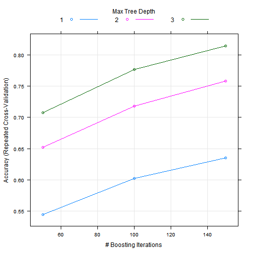

#Synopsis

This document summarizes quantitative analysis of data from accelerometers on the belt, forearm, arm, and dumbell of 6 participants as described in the [source publication](http://groupware.les.inf.puc-rio.br/har).
The idea is to predict the ways the barbell lifts were done from the data. The report is comprized as follows.
First section describes thw raw data and how it were read. Second section is dedicated to dimensionality reduction preprocessing and actual learning then we conclude with results.


#Reading Raw Data
We begin by observing that only a subset of data in columns below is meaningful for analysis because the measurements are present in all observations. The first column *classe* represents the way the barbell lift was done. It is the expected outcome. We also load **caret** library for subsequent analysis. 


```r
library(caret) 
columns <- c("classe",
             "roll_belt", "pitch_belt", "yaw_belt", "total_accel_belt",
             "gyros_belt_x", "gyros_belt_y", "gyros_belt_z", 
             "accel_belt_x", "accel_belt_y", "accel_belt_z",	
             "magnet_belt_x", "magnet_belt_y","magnet_belt_z",	
             "roll_arm", "pitch_arm","yaw_arm",	"total_accel_arm",
             "gyros_arm_x", "gyros_arm_y","gyros_arm_z", 
             "accel_arm_x", "accel_arm_y", "accel_arm_z",	
             "magnet_arm_x", "magnet_arm_y","magnet_arm_z",
             "roll_dumbbell", "pitch_dumbbell",	"yaw_dumbbell",
             "gyros_dumbbell_x","gyros_dumbbell_y","gyros_dumbbell_z",	
             "accel_dumbbell_x", "accel_dumbbell_y", "accel_dumbbell_z",	
             "magnet_dumbbell_x", "magnet_dumbbell_y","magnet_dumbbell_z",	
             "roll_forearm", "pitch_forearm", "yaw_forearm",
             "gyros_forearm_x","gyros_forearm_y","gyros_forearm_z",	
             "accel_forearm_x",	"accel_forearm_y", "accel_forearm_z",	
             "magnet_forearm_x","magnet_forearm_y","magnet_forearm_z")
```

The raw data is read then from the source file the unnecessary columns are dropped. The outcome column is 
casted as a factor to sunsequent use in a classificator.


```r
dfData <- read.csv("pml-training.csv")
dfDataTrain <- dfData[,columns]
dfDataTrain$classe <- as.factor(dfDataTrain$classe)
```


#Preprocessing and Learning 

In this section we describe the method we applied to arrive to our model.

##Preprocessing

The raw data set has about 50 possible predictors, naturally exhibiting a great deal of correlation. A decorrelating PCA procedure
can reduce the number of predictors without substantail information loss. 


```r
dfPredictors <- dfDataTrain[, -1]
preProc <- preProcess(dfPredictors, method = "pca", thresh = 0.95)
trainPC <- predict(preProc, dfPredictors)
```

Note that we reduce 50 variables to 24 while keeping 95% of information.

```r
str(trainPC)
```

```
## 'data.frame':	19622 obs. of  24 variables:
##  $ PC1 : num  -2.91 -2.94 -2.91 -2.92 -2.89 ...
##  $ PC2 : num  -3 -3.03 -3.03 -3.03 -3.08 ...
##  $ PC3 : num  -2.7 -2.7 -2.71 -2.69 -2.67 ...
##  $ PC4 : num  0.9 0.903 0.901 0.899 0.891 ...
##  $ PC5 : num  -1.55 -1.63 -1.56 -1.57 -1.59 ...
##  $ PC6 : num  1.83 1.9 1.84 1.88 1.91 ...
##  $ PC7 : num  -0.316 -0.359 -0.341 -0.373 -0.385 ...
##  $ PC8 : num  -3.16 -3.11 -3.13 -3.1 -3.11 ...
##  $ PC9 : num  0.255 0.292 0.29 0.308 0.268 ...
##  $ PC10: num  -0.0967 -0.1175 -0.1079 -0.1235 -0.1441 ...
##  $ PC11: num  0.375 0.388 0.375 0.371 0.437 ...
##  $ PC12: num  -1.59 -1.47 -1.5 -1.52 -1.46 ...
##  $ PC13: num  -1.71 -1.76 -1.74 -1.76 -1.66 ...
##  $ PC14: num  1.06 1.1 1.07 1.08 1.07 ...
##  $ PC15: num  -1.38 -1.33 -1.37 -1.3 -1.39 ...
##  $ PC16: num  0.398 0.372 0.393 0.391 0.332 ...
##  $ PC17: num  -0.571 -0.56 -0.567 -0.548 -0.563 ...
##  $ PC18: num  -0.309 -0.362 -0.316 -0.338 -0.339 ...
##  $ PC19: num  -1.19 -1.17 -1.19 -1.17 -1.16 ...
##  $ PC20: num  0.908 0.856 0.879 0.854 0.883 ...
##  $ PC21: num  -0.323 -0.303 -0.303 -0.346 -0.316 ...
##  $ PC22: num  -0.171 -0.196 -0.18 -0.176 -0.161 ...
##  $ PC23: num  -0.148 -0.106 -0.152 -0.156 -0.145 ...
##  $ PC24: num  0.0423 0.0647 0.0212 0.0403 0.0327 ...
```

##Training a Model

First, we define that the K-fold cross validation strategy should be implemented for training. We chose K = 5 to 
arrive to abalance between bias and variabilit yof the model


```r
fitControl <- trainControl(method = "repeatedcv",
                           number = 5,
                           repeats = 5)
```

Next, we set the seed:

```r
set.seed(12345)
```

And train a Stochastic Gradient Boosting model. Since it takes time, we do not evaluate it here, but save the model 
in a file. 


```r
gmbFit <- train(dfDataTrain$classe ~ ., 
                data = trainPC,
                method = "gbm",
                trControl = fitControl,
                verbose = FALSE)
saveRDS(gmbFit, file = "gmbFit.Rda")
```

Then we can load the data set at any time

```r
gmbFit <- readRDS(file = "gmbFit.Rda")
```

#Results

Let us plot the accuracy of the model:

```r
plot(gmbFit, metric = "Accuracy")
```

 

From the plot we see that with Depth = 3 and more than 140 boosting iterations the model arrives to about 82% accuracy,
i.e. about 18% of expected out-of-sample misclassification.

